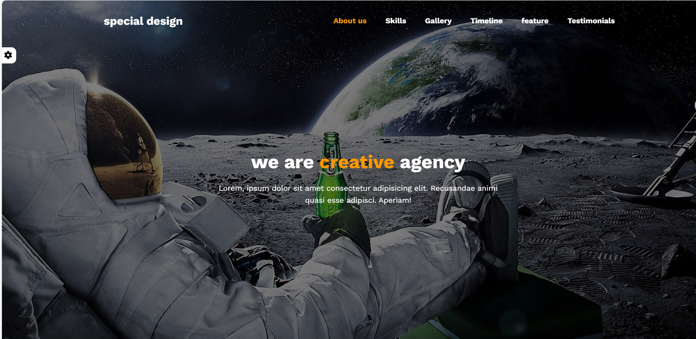

<!-- 🌟 PROJECT BANNER -->
<p align="center">
  
</p>

<!-- HEADER -->
<h1 align="center">💻 HTML, CSS & JS Template 1</h1>
<h3 align="center">
  A Clean and Responsive Web Template Designed by 
  <span style="color:#8B5CF6;">Ahmed Moatz</span>
</h3>

---

## 🚀 Overview

**HTML-CSS-JS-Template-1** is a modern and minimal web template built using  
**HTML, CSS, and Vanilla JavaScript**.

The template follows a **terminal-style / modern dark UI** with smooth interactions powered by JavaScript.
It’s perfect for beginners and front-end developers who want to understand **structure, styling, and basic interactivity**.

---

## 🧠 Features

- 🖤 Fully responsive layout  
- 💜 Clean and semantic HTML structure  
- ⚡ Pure CSS with reusable components  
- 🧠 JavaScript for interactivity and dynamic behavior  
- 🧩 Modern dark & purple theme  
- 📱 Works on all screen sizes (mobile, tablet, desktop)

---

## 🛠️ Tech Stack

<p align="center">
  
</p>

---

## 🌐 Live Demo

**See the website in action**

<p align="center">
  <a href="https://ahmedmoatz1.github.io/HTML-CSS-JS-Template-1/" target="_blank">
    
  </a>
</p>

---

## ⚙️ How to Use

1. **Clone the repository**
   ```bash
   git clone https://github.com/Ahmedmoatz/HTML-CSS-JS-Template-1.git
